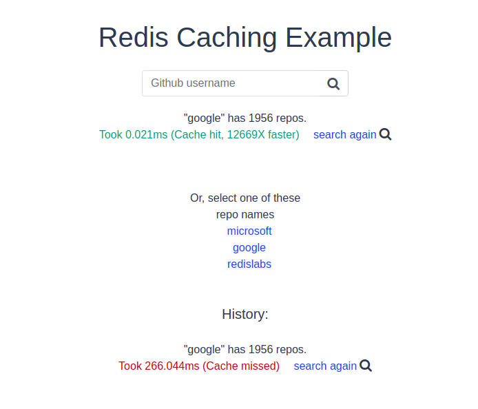

# Basic Redis caching demo with Ruby

This app returns the number of repositories a Github account has. When you first search for an account, the server calls **Github's API** to return the response. This can take **200-500ms** (local testing results). The server then caches details of this response with **Redis** for future requests. When you search again, the next response comes directly from Redis cache instead of calling Github. Responses become much faster - **0.01ms - 0.035ms** (local testing results)



## How to run it locally?

### Prerequisites

- Ruby - v2.7.0
- Rails - v5.2.4
- PostgreSQL - v10.16
- NPM - v7.6.0

### Local installation:

#### Go to `/server` folder and then run commands:

```sh
# copy files and set proper data inside
cp config/application.yml.example config/application.yml

- REDIS_ENDPOINT_URI: Redis server URI
- REDIS_PASSWORD: Password to the server
- FRONTEND_ENDPOINT: Connection with frontend
- HOST: Your host

cp config/database.yml.example config/database.yml
```

```sh
bundle install
rails db:create
```

#### Go to root and then `/client` folder and run command:

```sh
yarn install
```

#### And then from the root:

##### Run frontend

```sh
cd client
npm run serve
```

#### Run backend

```sh
cd server
rails s 
```